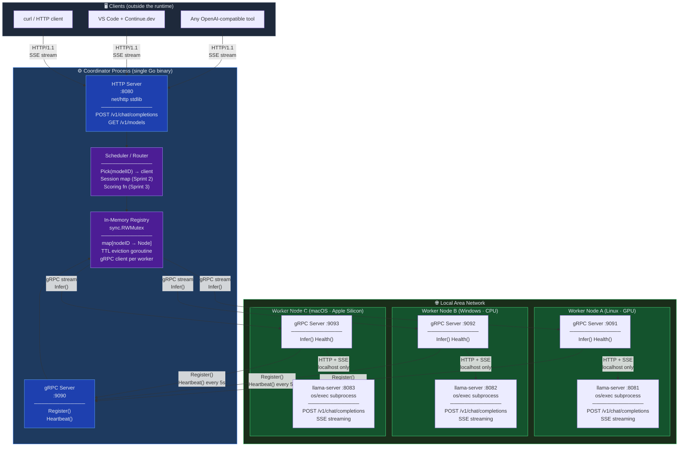
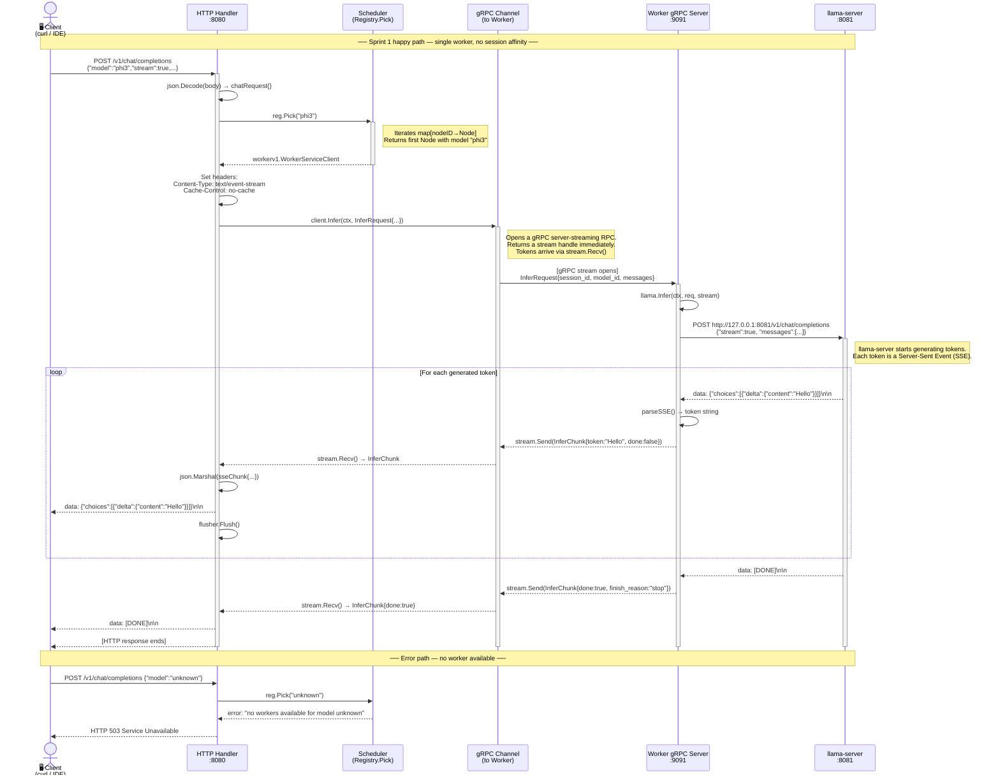
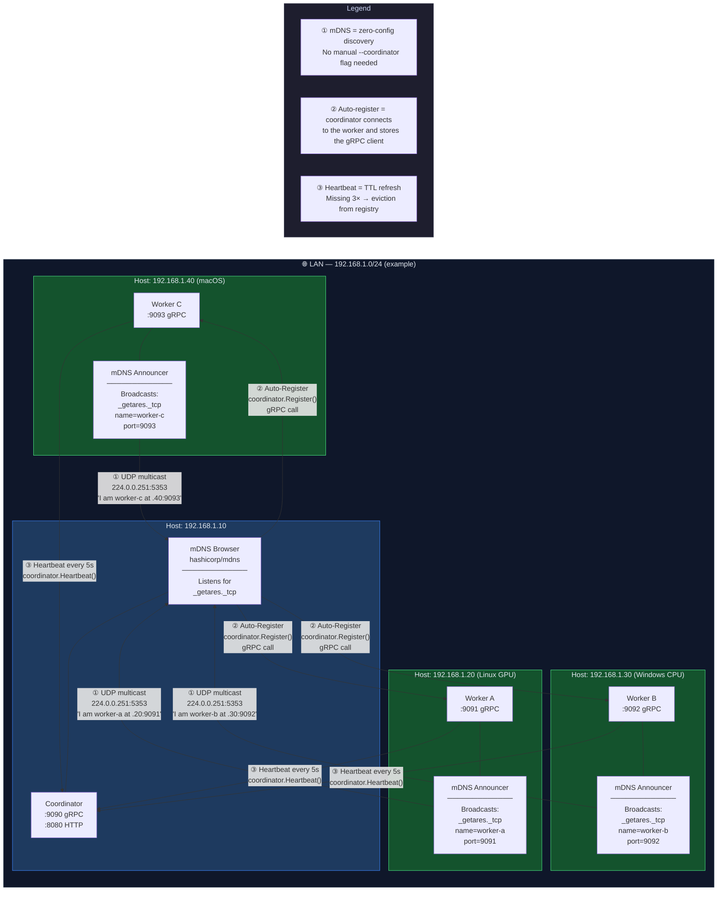
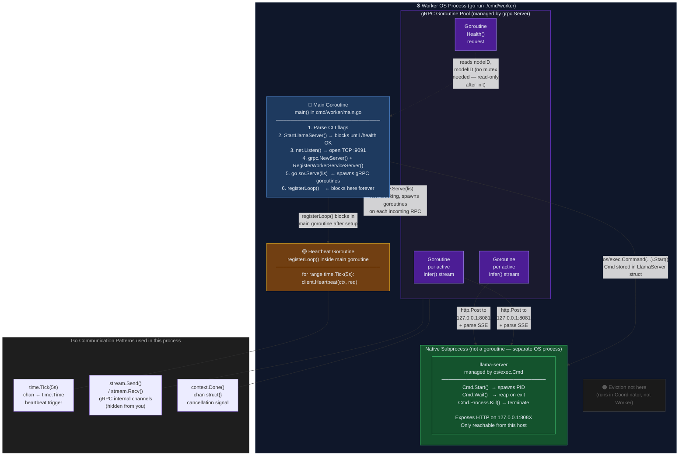

# Getares — Visual Architecture Reference

> **How to render these diagrams**
> - **GitHub:** Push this file as any `.md` file. GitHub renders Mermaid natively.
> - **VS Code:** Install the extension [Markdown Preview Mermaid Support](https://marketplace.visualstudio.com/items?itemName=bierner.markdown-mermaid), then open Preview (`Cmd+Shift+V` / `Ctrl+Shift+V`).
> - **Standalone:** Paste any block into [mermaid.live](https://mermaid.live) to render and export as SVG/PNG.

---

## Diagram 1 — General Architecture View (The LAN Ecosystem)

This is the **10,000-foot view** of the entire system. Read it top-to-bottom: clients at the top, infrastructure at the bottom.



### How to read it — Java → Go translation

**The Coordinator is not a class, it is a process.** In Java you might model this as a service with injected dependencies. In Go, it is a binary that wires its components in `main.go` and passes them by pointer. `Registry` is the shared state — everything else holds a reference to it.

**`sync.RWMutex` is your `ReadWriteLock`.** The Registry uses it to protect the `map[string]*Node`. Multiple goroutines can read concurrently (`RLock`), but writing (registering or evicting a node) requires exclusive access (`Lock`). Forgetting to unlock is the Go equivalent of a deadlock — always use `defer mu.Unlock()` immediately after `mu.Lock()`.

**The gRPC client lives inside the Registry, not in the worker.** When a worker registers, the coordinator opens a gRPC connection *to the worker* and stores it in `Node.Client`. This is the connection the coordinator uses later when it calls `Infer()`. The worker does not call back — the coordinator calls forward.

**Critical edge case — eviction race:** The eviction goroutine runs every 5 seconds and calls `Lock()`. If a request is in-flight using `Node.Client` at the same moment eviction tries to `delete(r.nodes, id)` and `conn.Close()`, you have a race condition. Sprint 1 ignores this (acceptable). Sprint 4 fixes it by reference-counting active streams before closing.

---

## Diagram 2 — Request Lifecycle Flow (Sprint 1 — The Vertical Slice)

This is a **sequence diagram**: time flows top-to-bottom, and each vertical bar is an active participant. An arrow is a function call or network message.



### How to read it — Java → Go translation

**`client.Infer()` does not block until all tokens arrive.** This is the key mental shift. In Java you might call a method and get a result. Here, `client.Infer()` returns a *stream handle* immediately. You then loop calling `stream.Recv()` — each call blocks until the next token arrives. This is like Java's `Iterator.next()` but over a network.

**`flusher.Flush()` is mandatory for SSE.** Go's `http.ResponseWriter` buffers writes by default. Without `Flush()` after each token, the client sees nothing until the entire response is buffered — which defeats streaming. Always type-assert to `http.Flusher` and call it after every `fmt.Fprintf`.

**`context.Context` is the kill switch for the whole chain.** When the client disconnects mid-stream, Go's HTTP server cancels the request context. This cancellation propagates through `client.Infer(ctx, ...)` to the gRPC channel, which cancels the stream to the worker, which cancels the HTTP request to llama-server. The entire chain cleans up automatically — *only if you pass the context through every call*. Never ignore the `ctx` parameter.

**Critical edge case — `stream.Recv()` returns `io.EOF` on clean end, not `nil`.** The loop termination condition is:
```go
chunk, err := stream.Recv()
if err == io.EOF { break }         // ← normal end
if err != nil { return err }       // ← real error
```
If you treat `io.EOF` as an error, you break the streaming response for every successful request.

---

## Diagram 3 — Network Topology and Discovery (Sprint 2 — mDNS)

This diagram shows **what happens on the LAN** when mDNS is active. It has two phases: discovery (one-time, on startup) and operation (ongoing).



### How to read it — Java → Go translation

**mDNS is UDP multicast, not TCP.** Workers broadcast to the special address `224.0.0.251` on port `5353`. Every device on the LAN receives this — there is no server to configure. The coordinator's mDNS browser receives these broadcasts and automatically calls `Register()`. Think of it as a pub/sub bus built into every LAN.

**`hashicorp/mdns` handles the multicast plumbing.** You do not write UDP code. You call `mdns.Register(service)` on the worker side and `mdns.Lookup("_getares._tcp", entriesCh)` on the coordinator side. The library fires entries into a Go channel (`chan *mdns.ServiceEntry`) as workers appear.

**mDNS is complementary to heartbeats, not a replacement.** mDNS tells the coordinator "this worker exists." Heartbeats tell it "this worker is still alive." mDNS discovery is a one-time event per worker startup. Heartbeats run every 5 seconds forever. If a worker crashes silently (no graceful shutdown), mDNS never fires a "goodbye" — the coordinator only knows about the crash when heartbeats stop and TTL expires.

**Critical edge case — mDNS does not work across subnets.** UDP multicast is limited to the local subnet. If your team has machines on different VLANs or subnets, mDNS will not reach them. The fallback is the original `--coordinator` flag (manual registration), which continues to work alongside mDNS. Both paths converge at `Registry.Add()`.

---

## Diagram 4 — Worker Process Internal Structure (Concurrency Map)

This diagram maps the **concurrency model inside one Worker process**. Each box is a goroutine. Arrows show how they communicate.



### How to read it — Java → Go translation

**`go srv.Serve(lis)` creates a goroutine *pool*, not a single thread.** When you write `go srv.Serve(lis)`, you launch the gRPC server in a goroutine. The gRPC library internally creates one new goroutine per incoming RPC call. If 10 clients call `Infer()` simultaneously, there are 10 goroutines running concurrently. This is unlike Java's thread pools where you configure size — Go goroutines are ~2KB stack, and the runtime manages them. You can have thousands.

**`llama-server` is not a goroutine — it is a separate OS process.** This is the most important distinction in the Worker. `exec.Command(...).Start()` forks a real OS process with its own PID. It is not concurrent Go code — it is concurrent at the OS level. Go communicates with it over HTTP (localhost only). `cmd.Process.Kill()` sends `SIGKILL`. `defer llama.Stop()` in `main.go` ensures it is killed when the worker exits — without this, orphaned `llama-server` processes accumulate every time you restart the worker during development.

**The main goroutine blocks in `registerLoop()` by design.** In Java you might put the heartbeat in a `@Scheduled` method and let the main thread return. In Go, if `main()` returns, the entire program exits — all goroutines are killed. So the main goroutine must block on something meaningful. `registerLoop()` loops forever on `time.Tick(5s)`, which is a perfect blocking point. The gRPC server runs independently in its goroutine.

**`context.Done()` is your thread-interrupt equivalent.** In Java, `Thread.interrupt()` signals a thread to stop. In Go, you cancel a `context.Context`. When the client disconnects during an `Infer()` stream, Go's HTTP server cancels the request context. This signals cancellation through the gRPC stream's context, which unblocks `stream.Recv()` in the coordinator and cancels the HTTP request to llama-server. The entire chain unwinds — but only if every function in the chain accepts and forwards `ctx`.

**Critical edge case — calling `cmd.Wait()` is not optional.** After `cmd.Process.Kill()`, you must call `cmd.Wait()` to reap the process. If you do not, you create a zombie process (a process that has exited but whose entry in the OS process table has not been freed). In long-running development sessions, zombie llama-server processes can exhaust OS limits. The `Stop()` method in `LlamaServer` handles this correctly — never kill the process without waiting for it.

---

## Quick Reference — Go Concurrency Patterns in this project

| Pattern | Where used in Getares | Java equivalent |
|---|---|---|
| `go func()` | Launch gRPC server, eviction loop | `new Thread(...).start()` |
| `sync.RWMutex` | Registry node map | `ReadWriteLock` |
| `time.Tick(d)` | Heartbeat loop | `ScheduledExecutorService` |
| `context.Context` | Cancel chains on disconnect | `Thread.interrupt()` |
| `defer` | Cleanup llama-server, unlock mutex | `finally` block |
| `chan T` | gRPC stream internals, mDNS entries | `BlockingQueue<T>` |
| `os/exec.Cmd` | llama-server subprocess | `ProcessBuilder` |
| `io.EOF` | End of gRPC stream | `StopIteration` / `hasNext()` == false |
| `http.Flusher` | SSE streaming | `response.flushBuffer()` in Servlet |
